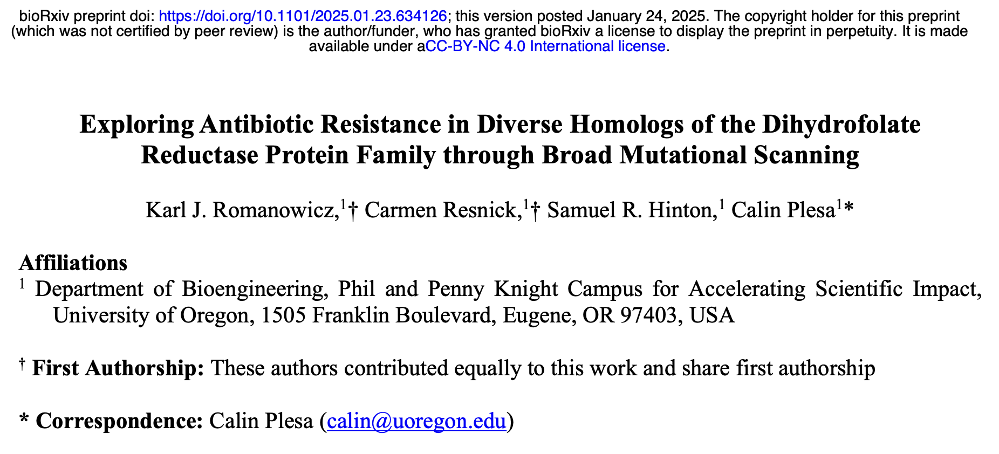

## Broad Mutational Scanning of the Dihydrofolate Reductase Protein Family

### [Karl J. Romanowicz](https://kromanowicz.github.io/), Carmen Resnick, Samuel R. Hinton, Calin Plesa
_____________________________________

This GitHub repository hosts R Markdown (RMD) files and links to the rendered code for reproducing the data analysis in the following preprint:

Romanowicz KJ, Resnick C, Hinton SR, and Plesa C. (2025) *Exploring antibiotic resistance in diverse homologs of the dihydrofolate reductase protein family through broad mutational scanning.* ***Science Advances***. [https://www.science.org/doi/10.1126/sciadv.adw9178](https://www.science.org/doi/10.1126/sciadv.adw9178)

**Links to Rendered Code:**

[Mapping Files Analysis](http://rpubs.com/kjromano/dhfr_mapping_rmd)

[Sequencing Counts Analysis](https://rpubs.com/kjromano/dhfr_counts_rmd)

[Perfect Homologs Analysis](https://rpubs.com/kjromano/dhfr_perfects_rmd)

[Mutant Homologs Analysis](https://rpubs.com/kjromano/dhfr_mutants_rmd)

[Broad Mutational Scanning Analysis](https://rpubs.com/kjromano/dhfr_bms_rmd)

[Gain-of-Function Mutants Analysis](https://rpubs.com/kjromano/dhfr_gof_rmd)

[Resistant Taxa Fitness Analysis](https://rpubs.com/kjromano/dhfr_resistance_rmd)

[Dialout Variants Fitness Analysis](https://rpubs.com/kjromano/dhfr_dialout_rmd)

**NCBI BioProject:** [PRJNA1189478](https://www.ncbi.nlm.nih.gov/bioproject/1189478) for raw .fastq files used in Makefile

**FigShare Repository:** [DHFR.zip](http://dx.doi.org/10.6084/m9.figshare.28266890) for mapping and count files used in RMD analysis
_____________________________________

This pipeline processes a library of 1,536 DHFR homologs and their associated mutants, with two-fold redundancy (two codon variants per sequence). Fitness scores are derived from a multiplexed in-vivo assay using a trimethoprim concentration gradient, assessing the ability of these homologs and their mutants to complement functionality in an *E. coli* knockout strain and their tolerance to trimethoprim treatment. This analysis provides insights into how antibiotic resistance evolves across a range of evolutionary starting points. Sequence data were generated using the Illumina NovaSeq platform with 100 bp paired-end sequencing of amplicons.

**Direct any questions regarding this repository to the corresponding author:** [Calin Plesa](mailto:calin@uoregon.edu).
