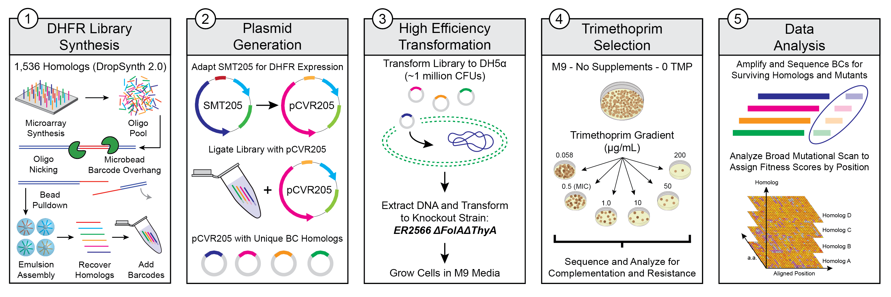

## Broad Mutational Scanning of the Dihydrofolate Reductase Protein Family

### [Karl J. Romanowicz](https://kromanowicz.github.io/), Carmen Resnick, Samuel R. Hinton, Calin Plesa
_____________________________________

This R Notebook provides complete reproducibility of the data analysis presented in ***"Broad Mutational Scanning for Antibiotic Resistance in the DHFR Protein Family Using Multiplexed Gene Synthesis in Emulsions"*** by Romanowicz, Resnick, Hinton, and Plesa (*In Prep*).

This pipeline processes a library of 1,536 DHFR homologs and their associated mutants in two-fold redundancy (two codon versions). It derives fitness scores from multiple time points during a multiplexed in-vivo assay, characterizing the ability of these homologs and their mutants to complement functionality of an E. coli knockout strain and to tolerate treatment against the antibiotic trimethoprim. This analysis will allow us to understand how antibiotic resistance emerges given many evolutionarily divergent starting points. Sequence data were generated using the Illumina NextSeq platform using 100 bp paired-end sequencing read amplicons.

**Links to Rendered Code:**

[Mapping Files Analysis]()

[Sequencing Counts Analysis]()

[Perfects Homologs Analysis]()

[Mutant Homologs Analysis]()

[Broad Mutational Scanning Analysis]()

[Gain-of-Function Mutants Analysis]()

[Resistant Taxa Fitness Analysis]()

[Dialout Variants Fitness Analysis]()

**NCBI BioProject:** [PRJNA794857]() for raw .fastq files

**Direct any questions regarding this repository to the corresponding author:** [Calin Plesa](mailto:calin@uoregon.edu).
