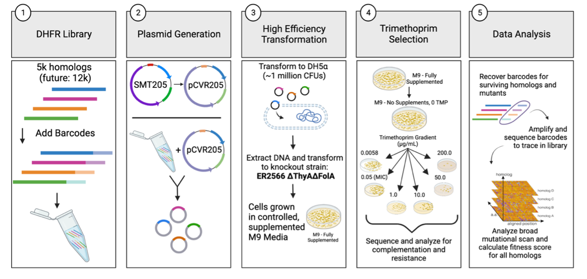

## Broad Mutational Scanning of the Dihydrofolate Reductase Protein Family

### Karl J. Romanowicz, Carmen Resnick, Samuel R. Hinton, Calin Plesa
_____________________________________

This R Notebook provides complete reproducibility of the data analysis presented in ***"Broad mutational scanning of the dihydrofolate reductase protein family"*** by Romanowicz, Resnick, Hinton, and Plesa (*In Prep*).

This pipeline processes a library of 5,756 DHFR homologs and their associated mutants in two-fold redundancy (two codon versions) to derive fitness scores from multiple time points during a multiplexed in-vivo assay that characterizes the ability of these homologs and their mutants to complement functionality of an E. coli knockout strain and to tolerate treatment against the antibiotic trimethoprim, which will allow us to understand how antibiotic resistance emerges given many evolutionarily divergent starting points. Sequence data were generated using the Illumina NovaSeq platform using paired-end sequencing read amplicons.

**Direct any questions regarding this repository to the corresponding author:** [Calin Plesa](mailto:calin@uoregon.edu).
